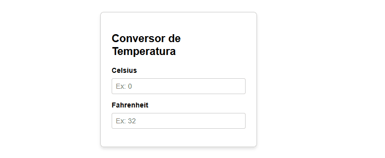

# Conversor de Temperatura

## Ambiente 

- Angular CLI Versão: 16.x
- Angular Core Versão: 16.x
- Porta Padrão: 4200

## Resultado Esperado


## Requisitos de Funcionalidade

- A interface possui 2 campos numéricos de entrada. O primeiro é para um valor em Celsius, e o segundo é para um valor em Fahrenheit[cite: 2].
- Inicialmente, ambos os campos devem estar vazios[cite: 2].
- Conforme um valor é digitado no campo **Celsius**, converta-o para Fahrenheit e exiba o resultado no campo Fahrenheit[cite: 2]. 
  - Use a fórmula `F = (C * 9/5) + 32` para a conversão[cite: 2]. 
  - No caso de valores decimais, exiba até 1 casa decimal[cite: 2].
- Conforme um valor é digitado no campo **Fahrenheit**, converta-o para Celsius e exiba o resultado no campo Celsius[cite: 2]. 
  - Use a fórmula `C = (F - 32) * 5/9` para a conversão[cite: 2]. 
  - No caso de valores decimais, exiba até 1 casa decimal[cite: 2].

## Requisitos de Teste

- O input de Celsius deve possuir o atributo `data-test-id="celsius-input"`[cite: 2].
- O input de Fahrenheit deve possuir o atributo `data-test-id="fahrenheit-input"`[cite: 2].

## Comandos

- Para rodar a aplicação: 
```bash
npm start
```
